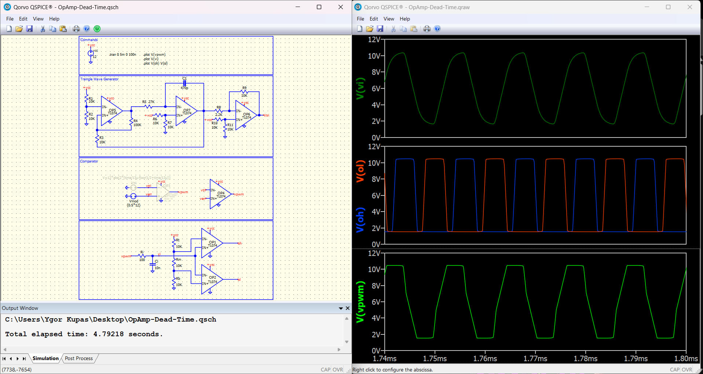
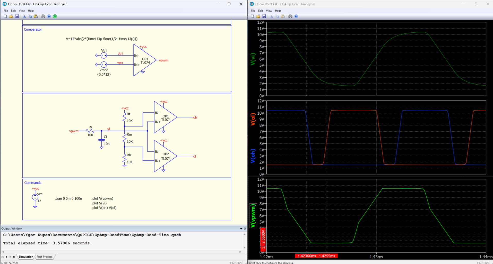

# OpAmp-DeadTime

Switching dead time using TL074 OpAmp in Qspice for synchronous switching inverter aplications.

## Simulation

IT is implemented with 2 OpAmps and garantees that none of the switches are on together (it may damage the switches or at least shorten its lifecycle).

